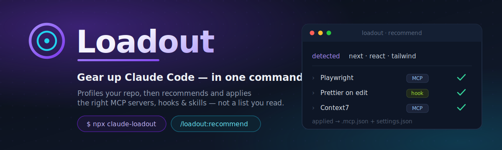

<div align="center">



<br/>

### Loadout은 당신의 프로젝트를 보고, 거기에 맞게 Claude Code를 자동으로 세팅합니다.

내 스택에 실제로 맞는 **MCP 서버·훅·스킬**이 뭔지 골라내서, 각각 *왜 필요한지* 이유와 함께 짧은 랭킹으로 보여주고,
**고른 것만 설치**합니다 — 설정 파일까지 대신 작성해서요. 500개짜리 "awesome" 리스트를 읽고 설치 명령을 손으로
복붙하는 대신, 명령어 하나로.

**에이전트 횡단:** Claude Code는 풀 세팅, **Codex·Cursor·opencode·Gemini CLI·OpenClaw**에는 MCP 서버까지 적용.

[English](README.md) · [한국어](README.ko.md)


</div>

---

> **한 줄 요약:** repo를 가리키면 → 그 repo에 맞는 Claude Code 확장을 추천하고 → 적용해줍니다.

## 문제

Claude Code 생태계에는 수천 개의 스킬·MCP 서버·훅·플러그인이 있고, 수십 개의 "awesome" 리스트에 흩어져 있습니다.
하지만 전부 **발견용(discovery) 리스트**입니다. 수백 개 항목을 직접 읽고 "내게 뭐가 맞지?"를 스스로 추측해야 하죠.
커뮤니티의 표현대로, *"awesome 리스트의 함정은 그걸 설치 목록처럼 쓰는 것 — 사실은 발견 목록일 뿐이다."*

정작 당연한 질문은 아무도 풀지 않았습니다: **내 프로젝트에는 실제로 뭘 깔아야 하고, 그걸 그냥 대신 해줄 수 없나?**

그게 Loadout입니다.

## 무엇을 하나

<p align="center"></p>

```text
$ npx claude-loadout

🎯 Loadout  — 이 프로젝트에 맞게 Claude Code 세팅 중

감지됨: package.json, next, react, tailwind, prettier, playwright
적합 도메인: Frontend / Web UI, General / Any project

추천 로드아웃:

 1  Playwright (브라우저 자동화)  [MCP server]
     실제 브라우저를 접근성 스냅샷으로 조작 — 이동·클릭·검증·스크린샷. 웹 UI 검증 표준.
     이유: react, next, playwright 매칭

 2  저장 시 JS/TS 자동 포맷 (Prettier)  [Hook/setting]
     Claude가 파일을 수정하면 그 파일만 Prettier 실행 → diff가 항상 깔끔.
     이유: package.json, prettier, react 매칭
 ...

설치할 항목? 번호 예: 1,3,4  ·  'a' = 전체  ·  Enter = 건너뛰기: 1,2,3

✅ 적용됨:
  .mcp.json          + playwright, context7
  .claude/settings.json + format-js-on-edit
```

프로젝트를 **스캔**(언어·프레임워크·CI·기존 설정)하고, 하나 이상의 도메인에 **매칭**한 뒤, 각 항목에 *왜 필요한지*
한 줄 이유를 붙여 짧은 로드아웃으로 **랭킹**하고, 당신이 **선택**하면, 설정을 **직접 작성**합니다 —
`.mcp.json`과 `.claude/settings.json`에 병합(덮어쓰지 않음)하고, 아직 채워야 할 토큰이 있으면 알려줍니다.

## 두 가지 사용법

### 1. Claude Code 안에서 (권장)

마켓플레이스를 한 번 추가하면, 추천기가 슬래시 명령어가 됩니다:

```text
/plugin marketplace add sukoji/loadout
/plugin install loadout@loadout

/loadout:recommend     # 이 repo를 분석해 로드아웃 추천 + 고른 것 적용
/loadout:browse        # 도메인별 카탈로그만 둘러보기 (변경 없음)
```

`/loadout:recommend`는 사람이 하듯 repo를 읽은 뒤, `AskUserQuestion`으로 원하는 항목을 체크하게 하고, 그 자리에서 적용합니다.

### 2. 독립 실행형 CLI

```bash
cd your-project
npx claude-loadout            # 대화형
npx claude-loadout --dry-run  # 추천만 보기
npx claude-loadout --all      # 추천 로드아웃 전체 적용
npx claude-loadout doctor     # 토큰·훅·보안 감사 (읽기 전용)
npx claude-loadout --help     # 플래그 전체 목록
```

의존성 0개, 스캔·추천 약 1초, 전역 설치 불필요. **CI/파이프 환경**에서는 `--dry-run` 또는 `--all`을 쓰세요 — 입력 대기로 멈추지 않습니다.

| `--dry-run` / `-d` | 추천만 표시, 파일 미작성 |
| `--all` / `-a` / `-y` | 상위 추천 전체 자동 적용 |
| `doctor` | 미입력 토큰, 훅 의존성(`jq`, `ruff`…), `.env` 보호 훅 점검 |
| `--discover` | 미검증 커뮤니티 스킬 추가 노출 |
| `--target <id>` | `cursor`, `codex`, `gemini` 등 에이전트별 MCP 설정 작성 |
| `--list-targets` | 지원 에이전트·설정 파일 경로 목록 |

### 자동 적용 vs 직접 실행

| 종류 | Loadout이 쓰나? | 사용자가 할 일 |
| :-- | :-- | :-- |
| MCP 서버 | ✅ `.mcp.json`(또는 에이전트 MCP 파일)에 병합 | API 키 입력; 호스팅 MCP는 첫 사용 시 OAuth |
| 훅·설정 | ✅ `.claude/settings.json`에 병합 | `jq`, `ruff` 등 설치; **Windows는 Git Bash/WSL**에서 Claude Code 실행 |
| 내장 스킬 (`/init` 등) | ❌ 이미 Claude Code에 포함 | 필요할 때 슬래시 명령 실행 |
| 마켓플레이스 플러그인 | ❌ `/plugin install …` 안내만 | Claude Code에서 명령 직접 실행 |

`npx claude-loadout doctor`로 미입력 토큰·누락된 PATH 도구를 언제든 점검할 수 있습니다.

## 내 에이전트에서 작동 — Claude Code 전용이 아님

MCP 서버는 요즘 에이전트 전반에 이식 가능하고, 설정 파일과 형식만 다릅니다. Loadout이 각각에 맞는 걸 써줍니다.
스킬·훅은 Claude Code 전용이라, 다른 에이전트에는 MCP 서버만 적용하고 Claude 전용인 건 알려줍니다.

```bash
npx claude-loadout --target codex        # .codex/config.toml 작성
npx claude-loadout --target cursor        # .cursor/mcp.json 작성
npx claude-loadout --target claude,cursor # 여러 개 동시 적용
npx claude-loadout --target all           # 지원하는 모든 에이전트
npx claude-loadout --list-targets         # 전체 목록 보기
```

| 타깃 (`--target`) | 에이전트 | 설정 파일 | MCP 형식 |
| :-- | :-- | :-- | :-- |
| `claude` *(기본)* | Claude Code | `.mcp.json` + `.claude/settings.json` | `mcpServers` + 스킬/훅 |
| `cursor` | Cursor | `.cursor/mcp.json` | `mcpServers` |
| `gemini` | Gemini CLI | `.gemini/settings.json` | `mcpServers` |
| `opencode` | opencode | `opencode.json` | `mcp` (`type: local`) |
| `codex` | Codex CLI | `.codex/config.toml` | `[mcp_servers.*]` (TOML) |
| `openclaw` | OpenClaw | `~/.openclaw/openclaw.json` | `mcp.servers` |

`--target`를 안 주면 Claude Code를 대상으로 하고, 프로젝트에서 감지된 다른 에이전트가 있으면 알려줍니다.

## 무엇이 다른가

| 다른 것들 | Loadout |
| :-- | :-- |
| 직접 읽고 걸러야 하는 평면 리스트 | *내* repo를 분석해 맞춤 추천 |
| "여기 500개 있음" | "*당신에게* 필요한 6개, 그리고 이유" |
| 설치 명령을 손으로 복붙 | `.mcp.json` / `settings.json`을 대신 작성 |
| 발견만 | 발견 **+ 적용**을 한 번에 |

동시에 **플러그인 마켓플레이스**이자 **둘러볼 수 있는 카탈로그**입니다 — 발견·추천·설치가 한곳에.

## 커버리지 — 3티어 (고정 리스트가 아님)

Loadout은 3티어에서 끌어와서, **검증 안 된 걸 무턱대고 적용하는 일 없이** 생태계 전체에 닿습니다:

- **큐레이션 (35)** — 손검증한 MCP·훅·스킬. 자동적용 안전, npx 패키지는 전부 npm 실존 확인.
- **공식 마켓 (~240)** — Anthropic 공식 플러그인 디렉터리를 자동 흡수. 내 스택에 맞으면 노출, `/plugin`으로 설치.
- **커뮤니티 (`--discover`)** — [caveman](https://github.com/JuliusBrussee/caveman)(토큰 절약) 같은 유명 커뮤니티 스킬. 요청할 때만 뜨고, **⚠ 미검증** 라벨, **자동적용 절대 안 함**.

```bash
npx claude-loadout            # 큐레이션 + 매칭되는 공식 플러그인
npx claude-loadout --discover # 커뮤니티 스킬까지 노출 (설치 전 검토)
```

## 도메인

Loadout은 큐레이션한 카탈로그를 "어떤 종류의 프로젝트인가" 기준으로 정리합니다:

| 도메인 | 대상 |
| :-- | :-- |
| [Frontend / Web UI](docs/domains/frontend.md) | React, Vue, Svelte, Next 등 브라우저용 |
| [Backend / API](docs/domains/backend-api.md) | 서버, API, 데이터베이스 |
| [Data / ML / Notebooks](docs/domains/data-ml.md) | 파이썬 데이터·학습·분석 |
| [Research / Academic](docs/domains/research.md) | 문헌 조사, 노트북, 논문, 실험 |
| [DevOps / Infra](docs/domains/devops.md) | CI/CD, Docker, Terraform, Kubernetes |
| [Mobile](docs/domains/mobile.md) | iOS, Android, React Native, Flutter |
| [Game Development](docs/domains/game-dev.md) | Godot, Unity, Unreal |
| [Security-sensitive](docs/domains/security.md) | 인증, 결제, 개인정보 |
| [Docs / Writing / Office](docs/domains/docs-writing.md) | 문서와 실제 Word/Excel/PDF/PPT 산출물 |
| [General / Any project](docs/domains/general.md) | 항상 유용한 기본 세트 |

전체 색인: [docs/domains/](docs/domains/README.md).

## 동작 방식

```
내 repo ──▶ 스캔(시그널) ──▶ 도메인 매칭 ──▶ 로드아웃 랭킹 ──▶ 선택 ──▶ 적용
           package.json,     frontend +     시그널          멀티      .mcp.json
           requirements.txt,  general        강도순          셀렉트    .claude/settings.json
           Dockerfile, .env…                                          + 설치 명령
```

- **카탈로그**(`plugins/loadout/catalog/*.json`)가 단일 진실 소스입니다 — MCP 서버·스킬·훅 각각에 맞는
  도메인과 시그널 태그가 붙어 있고, 스킬과 CLI가 같은 데이터를 읽습니다.
- **추천기**는 각 도메인의 시그널이 프로젝트에 몇 개 나타나는지로 점수를 매기고, 상위 도메인의 로드아웃을 합친 뒤,
  이미 있는 건 빼고 나머지를 랭킹합니다.
- **적용**은 설정에 깊은 병합을 합니다. 훅은 올바른 이벤트 배열에 추가되고, MCP 서버는 `mcpServers` 아래에,
  스킬은 실행할 `/plugin`·내장 명령을 정확히 출력합니다.

## 카탈로그 항목 기여하기

카탈로그는 커뮤니티와 함께 자라도록 설계됐습니다. `plugins/loadout/catalog/`의 해당 파일에 항목을 추가하고,
`domains`와 `signals` 태그를 붙인 뒤, 검사를 돌리고 PR을 올리세요:

```bash
npm run validate     # 카탈로그 무결성: 고유 id, 필수 필드, 도메인 참조
npm run build:docs   # 카탈로그로부터 docs/domains/ 재생성
```

항목 스키마는 [CONTRIBUTING.md](CONTRIBUTING.md) 참고.

## 로드맵

- [ ] `claude-loadout`를 npm에 배포해 `npx` 지원
- [ ] 도메인 추가 (게임 개발, 임베디드, 브라우저 확장, Rust 시스템)
- [ ] 커뮤니티 투표 기반 관련도 시그널
- [ ] `loadout doctor` — 기존 세팅 감사 후 빠진 것 제안
- [ ] 팀 로드아웃 — 프로젝트 로드아웃을 파일 하나로 공유

## 라이선스

MIT © sukoji. 카탈로그가 링크하는 서드파티 도구는 각 저작자의 소유이며, Loadout은 이를 큐레이션·설정만 합니다.
